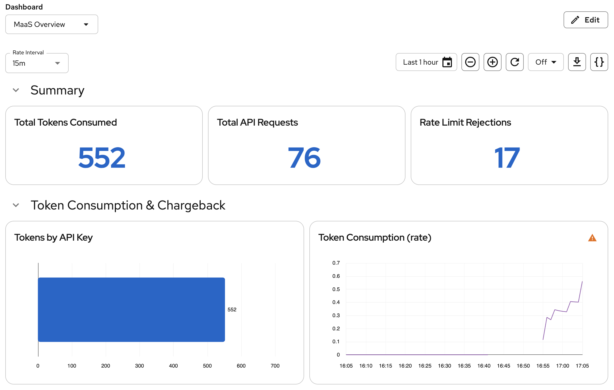

# Chapter 5: Observability & Rate Limiting

The platform is live — now make it observable. In this chapter you'll:

1. Enable telemetry for token tracking
2. Tighten token limits and trigger rate limits with curl
3. Query metrics for chargeback
4. Enable vLLM model server metrics for performance monitoring
5. Deploy a Perses dashboard in the OpenShift console

## Before You Begin

Every curl example in this chapter uses a `department-b` API key on the `limited-plan` subscription — that's the plan this chapter tightens and rate-limits. Confirm your user is still in `department-b` from Chapter 4, Step 5:

```bash
oc get groups | grep department
```

Expected output — your username under `department-b`, not `department-a`:

```
department-a
department-b   admin
```

If your username isn't under `department-b`, move it there:

```bash
oc adm groups remove-users department-a $(oc whoami)
oc adm groups add-users department-b $(oc whoami)
```

API keys capture group membership at creation time, so generate a fresh key now rather than reusing an older one:

```bash
export ROUTE_HOST=$(oc get route openshift-ai-inference -n openshift-ingress -o jsonpath='{.spec.host}')
export MAAS_API_KEY=$(curl -s -k -X POST https://$ROUTE_HOST/maas-api/v1/api-keys \
  -H "Authorization: Bearer $(oc whoami -t)" \
  -H "Content-Type: application/json" \
  -d '{"name":"department-b-chapter5","subscription":"limited-plan"}' | jq -r .key)
echo $MAAS_API_KEY
```

> **Getting `400 {"code":"invalid_subscription",...}`?** The MaaS API resolves `subscription` against your groups' auth policies — `standard-plan` only works for `department-a`, `limited-plan` only for `department-b`. The error means the subscription you asked for doesn't match the group you're currently in; re-check `oc get groups | grep department` above.

Keep `$MAAS_API_KEY` and `$ROUTE_HOST` exported for the rest of this chapter — later steps reference "your department-b key" assuming it's already set.

## Step 1: Verify Telemetry

Chapter 1 enabled Kuadrant observability and tenant telemetry on the gateway. Confirm the resources are still present before generating traffic:

```bash
oc get podmonitor kuadrant-limitador-monitor -n kuadrant-system
oc get telemetrypolicy maas-telemetry -n openshift-ingress
```

If either resource is missing, re-run the [MaaS Telemetry](../chapter-1/README.md#maas-telemetry) section from Chapter 1 and restart the gateway.

## Step 2: Trigger Rate Limiting

Each `MaaSSubscription` defines a per-model **token budget** — the maximum number of tokens a user can consume within a rolling time window. When the budget is exhausted the gateway returns `429 Too Many Requests` until the window resets. MaaS translates each `tokenRateLimits` entry into a Kuadrant `TokenRateLimitPolicy` on the model's HTTPRoute.

List the policies MaaS created:

```bash
oc get tokenratelimitpolicy -A
```

Inspect the TinyLlama policy for `department-b`'s limited plan:

```bash
oc get tokenratelimitpolicy maas-trlp-tinyllama -n ai-models -o json \
  | jq -r '.spec.limits | to_entries[] | "\(.key): \(.value.rates[0].limit) tok / \(.value.rates[0].window)"'
```

Expected output — the 1,000 tok/min value from your `MaaSSubscription`:

```
models-as-a-service-limited-plan-tinyllama-tokens: 1000 tok / 1m
```

> **Do not edit these resources directly.** The MaaS controller reconciles them from your `MaaSSubscription` definitions. Manual changes will be overwritten.

### Tighten the Limit for the Demo

The default 1,000 tok/min limit is too high for a quick demo. Lower TinyLlama to **100 tokens per minute** so a single request exhausts the budget and the next request gets a 429:

```bash
oc patch maassubscription limited-plan -n models-as-a-service --type=json \
  -p='[{"op": "replace", "path": "/spec/modelRefs/1/tokenRateLimits/0/limit", "value": 100}]'
```

Verify the MaaS controller updated the underlying policy:

```bash
oc get tokenratelimitpolicy maas-trlp-tinyllama -n ai-models -o json \
  | jq -r '.spec.limits | to_entries[] | "\(.key): \(.value.rates[0].limit) tok / \(.value.rates[0].window)"'
```

Expected output:

```
models-as-a-service-limited-plan-tinyllama-tokens: 100 tok / 1m
```

Restart the gateway so Limitador picks up the new limit:

```bash
oc rollout restart deployment/maas-default-gateway-data-science-gateway-class -n openshift-ingress
oc rollout status deployment/maas-default-gateway-data-science-gateway-class -n openshift-ingress --timeout=300s
```

### Smoke Test with curl

Confirm rate limiting works from your workstation. Use your `department-b` limited-plan key from Chapter 4 — rate limits are enforced per subscription, so a `department-a` key will not hit these limits. Send one request to consume tokens, then a second request that should be rejected:

```bash
curl -s -k -w '\nHTTP:%{http_code}\n' \
  -X POST https://$ROUTE_HOST/ai-models/tinyllama/v1/chat/completions \
  -H "Authorization: Bearer $MAAS_API_KEY" \
  -H "Content-Type: application/json" \
  -d '{
    "model": "tinyllama",
    "messages": [{"role": "user", "content": "Write a short paragraph about the history of bread."}],
    "max_tokens": 200,
    "stream": true,
    "stream_options": {"include_usage": true}
  }' | tail -3

curl -s -k -w '\nHTTP:%{http_code}\n' \
  -X POST https://$ROUTE_HOST/ai-models/tinyllama/v1/chat/completions \
  -H "Authorization: Bearer $MAAS_API_KEY" \
  -H "Content-Type: application/json" \
  -d '{
    "model": "tinyllama",
    "messages": [{"role": "user", "content": "Write a short paragraph about the history of bread."}],
    "max_tokens": 200,
    "stream": true,
    "stream_options": {"include_usage": true}
  }' | tail -1
```

Expected output — first request succeeds, second is rejected:

```
HTTP:200
HTTP:429
```

Or run the Red Hat quick-test loop (sends 10 rapid requests and counts status codes):

```bash
for i in $(seq 1 10); do
  curl -s -k -o /dev/null -w "%{http_code}\n" \
    -X POST https://$ROUTE_HOST/ai-models/tinyllama/v1/chat/completions \
    -H "Authorization: Bearer $MAAS_API_KEY" \
    -H "Content-Type: application/json" \
    -d '{"model":"tinyllama","messages":[{"role":"user","content":"test"}],"max_tokens":50,"stream":true,"stream_options":{"include_usage":true}}'
done | sort | uniq -c
```

Expected output — a mix of `200` and `429`:

```
   6 200
   4 429
```

> **What is being limited?** Actual tokens consumed (from `usage.total_tokens` in each response), not request count. Enforcement happens at the gateway — rejected requests never reach the model server.

### Troubleshooting

If every request returns `200` and you never see a `429`:

1. **Confirm the API key belongs to `limited-plan`.** Keys capture group membership at creation time. If you created the key while still in `department-a`, revoke it and create a new one on the `limited-plan` subscription (Chapter 4, Step 5).

2. **Confirm the limit patch applied:**

   ```bash
   oc get tokenratelimitpolicy maas-trlp-tinyllama -n ai-models -o json \
     | jq '.spec.limits[].rates[0].limit'
   ```

   Should print `100`.

3. **Confirm telemetry is enabled and the gateway was restarted** (Chapter 1). Rate limiting depends on the Kuadrant Wasm filters on `maas-default-gateway`:

   ```bash
   oc get telemetrypolicy maas-telemetry -n openshift-ingress
   oc get tokenratelimitpolicy maas-trlp-tinyllama -n ai-models \
     -o jsonpath='{.status.conditions[?(@.type=="Enforced")].status}{"\n"}'
   ```

4. **Check Limitador is receiving traffic** for the TinyLlama route:

   ```bash
   oc port-forward -n kuadrant-system svc/limitador-limitador 8080:8080 &
   sleep 2
   curl -s http://localhost:8080/metrics | grep tinyllama
   kill %1
   ```

   After the smoke test you should see metrics with `limitador_namespace="ai-models/tinyllama-kserve-route"`. If only `granite-2b` appears, restart the gateway and retry.

5. **Check Authorino logs** for subscription metadata errors:

   ```bash
   oc logs -n kuadrant-system deploy/authorino --tail=50 | grep selected_subscription
   ```

   Token rate limits only apply when `auth.identity.selected_subscription_key` matches your plan. If Authorino cannot resolve the subscription, limits are silently skipped.

   > **Note:** Authorino also logs `failed to evaluate CEL expression ... no such key: selected_subscription` (without `_key`) on essentially every request, for every model, even when everything works. That's a separate, benign metric-labeling expression and not evidence of a problem — only investigate further if you see errors that reference `selected_subscription_key` or `subscription-info` itself.

6. **Check for a Kuadrant Wasm shim task failure** — this is the most likely cause if steps 1–5 all check out and you still only see `200`s:

   ```bash
   GW_POD=$(oc get pods -n openshift-ingress -l 'gateway.networking.k8s.io/gateway-name=maas-default-gateway' -o jsonpath='{.items[0].metadata.name}')
   oc logs $GW_POD -n openshift-ingress --since=2m | grep "Task failed"
   ```

   If every `/v1/chat/completions` request is immediately preceded by a line like `kuadrant_wasm_shim: Task failed: Some("N")`, the gateway's rate-limiting Wasm filter is failing its async callout to Limitador on every request — token usage is never recorded, so the budget never depletes and `429` never fires. Confirmed reproducible on a completely fresh `maas-default-gateway` pod (i.e. not stale state) affecting **both** Granite and TinyLlama routes, on rhcl-operator v1.4.2. Restarting Limitador and the gateway does **not** clear it.

   This is a platform bug in Kuadrant's Wasm rate-limiting shim, not something fixable via `MaaSSubscription`/`TokenRateLimitPolicy` changes. If you hit this, the token-budget and 429 behavior in the rest of this chapter cannot be demonstrated until an upstream fix or a newer `rhcl-operator` build is available — check `oc get subscription rhcl-operator -n kuadrant-system -o jsonpath='{.status.installedCSV}'` against the latest in your catalog. The remaining steps in this chapter (metrics queries, vLLM PodMonitor, Perses dashboard) are unaffected and still worth completing — the `limited_calls` panel will simply stay at zero until the underlying bug is fixed.

## Step 3: Query Metrics (Chargeback)

### Verify Prometheus Pipeline

The `kuadrant-limitador-monitor` PodMonitor lives in `kuadrant-system`, a user namespace from monitoring's perspective — it's scraped by the **user workload monitoring** Prometheus enabled in Chapter 1, not the platform instance. Query `prometheus-user-workload`, not `prometheus-k8s`:

```bash
oc exec -n openshift-user-workload-monitoring sts/prometheus-user-workload -c prometheus -- \
  curl -s 'http://localhost:9090/api/v1/query?query=authorized_calls' | jq
```

### OpenShift Metrics Console

Open the **OpenShift Web Console** → **Observe → Metrics** and run these PromQL queries:

| Query | What it shows |
|---|---|
| `authorized_hits` | Total tokens consumed (the billing metric) |
| `authorized_calls` | Total successful API requests |
| `limited_calls` | Rate limit rejections (429 responses) |

Export to CSV using the **Download** icon for chargeback reports.

## Step 4: Enable vLLM Model Server Metrics

The gateway-level metrics (`authorized_hits`, `authorized_calls`, `limited_calls`) are scraped automatically via the Kuadrant Limitador PodMonitor. Model-server metrics such as **Time to First Token** come from the vLLM process inside each model pod and require a separate PodMonitor.

```bash
oc apply -f chapter-5/vllm-podmonitor.yml
```

Verify the PodMonitor is created and that Prometheus starts scraping:

```bash
oc get podmonitor vllm-metrics -n ai-models

# After ~30 seconds, confirm the metric exists in Prometheus (user workload instance)
oc exec -n openshift-user-workload-monitoring sts/prometheus-user-workload -c prometheus -- \
  curl -s 'http://localhost:9090/api/v1/query?query=vllm:time_to_first_token_seconds_count' \
  | jq '.data.result | length'
```

The result should be `2` (one per model). If `0`, check that the PodMonitor label selector matches the model server pods:

```bash
oc get pods -n ai-models --show-labels
```

Adjust the `spec.selector.matchLabels` in `vllm-podmonitor.yml` to match a label present on the vLLM model server pods, then re-apply.

## Step 5: Perses Dashboard

Instead of deploying a separate Grafana instance, we use [Perses](https://perses.dev/) — the cloud-native dashboard tool that ships with the Cluster Observability Operator (COO). Perses dashboards are Kubernetes CRDs: you manage them with `oc apply`, store them in Git, and control access via standard RBAC. The dashboards appear directly in the OpenShift console under **Observe → Dashboards (Perses)**.

### Install the Cluster Observability Operator

Install COO via OLM. This automatically deploys the Perses Operator and registers the Perses CRDs.

```bash
oc apply -f chapter-5/coo-subscription.yml
```

Wait for the operator to install:

```bash
CSV=$(oc get subscription cluster-observability-operator \
  -n openshift-cluster-observability-operator -o jsonpath='{.status.installedCSV}')
oc wait csv "$CSV" -n openshift-cluster-observability-operator \
  --for=jsonpath='{.status.phase}'=Succeeded --timeout=300s
```

Verify the Perses CRDs and operators are available:

```bash
oc get crds | grep perses
# persesdashboards.perses.dev
# persesdatasources.perses.dev
# persesglobaldatasources.perses.dev

oc get pods -n openshift-cluster-observability-operator
# observability-operator-...   1/1   Running
# perses-operator-...          1/1   Running
```

### Enable the Monitoring UIPlugin with Perses

Create a `UIPlugin` resource to enable the Perses UI in the OpenShift web console. This triggers creation of a Perses server instance and adds the **Observe → Dashboards (Perses)** menu item.

```bash
oc apply -f chapter-5/perses-ui-plugin.yml
```

Verify the UIPlugin is reconciled and the Perses server is running:

```bash
oc get uiplugin monitoring -o jsonpath='{.status.conditions[0].message}'
# Plugin reconciled successfully

oc get pods -n openshift-cluster-observability-operator -l app.kubernetes.io/name=perses
# perses-0   1/1   Running
```

> **Note:** After enabling the plugin, it may take a few minutes for the **Dashboards (Perses)** menu to appear in the OpenShift web console. A page refresh may be needed.

### Create a Global Thanos Querier Datasource

Connect Perses to the platform Thanos Querier so dashboards can query Prometheus metrics cluster-wide. This uses Kubernetes-native authentication — the Perses server's ServiceAccount authenticates to Thanos Querier using its projected token.

The manifest includes a `ClusterRoleBinding` that grants the Perses ServiceAccount the `cluster-monitoring-view` role, and a `PersesGlobalDatasource` that configures the connection.

```bash
oc apply -f chapter-5/perses-datasource.yml
```

Verify:

```bash
oc get persesglobaldatasources
# NAME                        AGE
# thanos-querier-datasource   ...
```

### Deploy the MaaS Overview Dashboard

Apply a `PersesDashboard` CR that visualises MaaS metrics. The dashboard is namespace-scoped and deployed to `ai-models`.

```bash
oc apply -f chapter-5/perses-dashboard.yml
```

This creates a dashboard with the following sections:

| Section | Panels | Metrics |
|---|---|---|
| **Summary** | Stat panels | `sum(authorized_hits)`, `sum(authorized_calls)`, `sum(limited_calls)` |
| **Token Consumption & Chargeback** | Bar chart + Time series | `sum(authorized_hits) by (app_id)`, `sum(rate(authorized_hits[$interval])) by (app_id)` |
| **Rate Limiting** | Time series charts | `sum(rate(authorized_calls[$interval]))` vs `sum(rate(limited_calls[$interval]))` |
| **Model Performance** | Time series chart | `histogram_quantile(0.95, sum(rate(vllm:time_to_first_token_seconds_bucket[$interval])) by (le, model_name))` |

A `$interval` variable (1m / 5m / 15m) controls the rate window for all panels.

Verify:

```bash
oc get persesdashboards -n ai-models
# NAME            AGE
# maas-overview   ...
```

### Access the Dashboard

1. Open the **OpenShift Web Console**
2. Navigate to **Observe → Dashboards (Perses)**
3. Select the **ai-models** project from the namespace dropdown
4. Click **MaaS Overview**

Generate some traffic so the dashboard has data to display. Run a quick curl loop against TinyLlama using your `department-b` key:

```bash
export MAAS_API_KEY="sk-oai-..."  # your department-b key from Chapter 4
export ROUTE_HOST=$(oc get route openshift-ai-inference -n openshift-ingress -o jsonpath='{.spec.host}')

for i in $(seq 1 20); do
  echo "Request $i:"
  curl -s -k -o /dev/null -w "  HTTP %{http_code}\n" \
    -X POST https://$ROUTE_HOST/ai-models/tinyllama/v1/chat/completions \
    -H "Authorization: Bearer $MAAS_API_KEY" \
    -H "Content-Type: application/json" \
    -d '{"model":"tinyllama","messages":[{"role":"user","content":"What is Kubernetes?"}],"max_tokens":100,"stream":true,"stream_options":{"include_usage":true}}'
  sleep 2
done
```

You should see a mix of `200` and `429` responses. Switch back to the Perses dashboard and watch the panels update in real time.



> **Tip:** Since the dashboard is a Kubernetes CR, you can also edit it interactively in the OpenShift console — changes are saved back to the `PersesDashboard` resource. Or export and edit as YAML:
>
> ```bash
> oc get persesdashboard maas-overview -n ai-models -o yaml > my-dashboard.yaml
> # Edit, then re-apply
> oc apply -f my-dashboard.yaml
> ```

---

🎉 **Congratulations!** You now have a fully governed, observable AI platform with subscription-based access control, rate limiting, and chargeback capabilities — with dashboards managed as Kubernetes CRDs directly in the OpenShift console.
